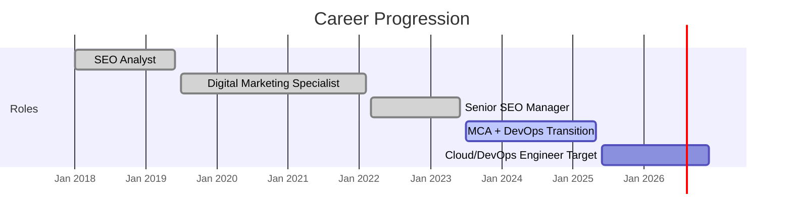

<!-- PROFILE HEADER -->

  

  

  
  
  
  
  

  <b>📍 Bengaluru, India · Open to Work 🚀</b>

  

---

## 📖 Table of Contents

- [👋 Who Am I?](#-who-am-i)
- [🚀 Core Tech Stack](#-core-tech-stack)
- [🌟 Flagship Projects (Live & Deployed)](#-flagship-projects-live--deployed)
- [📊 GitHub Contributions & Activity](#-github-contributions--activity)
- [🎯 Currently Working On](#-currently-working-on)
- [🏅 Certifications & Learning](#-certifications--learning)
- [🧭 Career Timeline](#-career-timeline)
- [📬 Let's Connect](#-lets-connect)
- [✨ Quick Facts](#-quick-facts)

---

# 👋 Who Am I?

> **From campaign optimizer to cloud engineer:**  
> I’m a **versatile problem solver** with **8+ years** leading SEO, DevOps, and cloud projects. My journey is about shipping real solutions—**not just learning, but delivering production code**.

- 🏆 **Leadership:** Managed a 10‑member SEO team at DigiMark Agency, driving automation and strategy.
- 🛠️ **DevOps & Cloud:** AWS, Docker, CI/CD, Terraform, production deployments with zero‑downtime releases.
- 🧑‍💻 **Automation:** Python scripting, FastAPI backends—I automate everything possible.
- 🏅 **AWS Certified:** Pursuing AWS Cloud Practitioner; hands‑on with EC2, S3, Lambda, CloudWatch.
- 📚 **Continuous learner:** MCA in progress (Manipal University), always growing.

---

# 🚀 Core Tech Stack

<b>☁️ Cloud & Infrastructure</b>

 

  
  
  
  
  
  

<b>⚙️ DevOps & Tools</b>

 

  
  
  
  
  
  

<b>🐍 Backend & Languages</b>

 

  
  
  
  
  

<b>🗂️ Databases</b>

 

  
  
  

---

# 🌟 Flagship Projects (Live & Deployed)

<!-- PulseCheck Repo Card -->

### 🟢 **PulseCheck** 🚀 Live on EC2
Automated, zero‑touch production deploys: push code → GitHub Actions → Docker → AWS EC2.  
  
  
  

**Skills:** CI/CD Pipeline • GitHub Actions • Docker • AWS EC2 • Secrets Management

 

<!-- S3 Static Website Repo Card -->

### 🌏 **S3 Static Website + CloudFront CDN**
Enterprise‑grade, globally distributed static sites for **$0/month**.  
  
  
  

**Skills:** AWS S3 • CloudFront • Terraform • IAM Security • Serverless Optimization

 

<!-- VoteChain Repo Card -->

### ⛓️ **VoteChain** — Blockchain Voting (MCA Final Project)
Decentralized, tamper‑proof voting using **Solidity** smart contracts, **React** frontend, **FastAPI** backend.  
  

**Skills:** Ethereum Dev • Blockchain Security • Full‑Stack DApp • Secure Auth

 

> **More projects:** BlueSkyMonitor (monitoring automation) and FinTrack (finance ETL) are pinned below.  
> *All repositories are actively maintained and represent real production‑grade work.*

---

# 📊 GitHub Contributions & Activity

<!-- Contribution Graph -->

  

<!-- Combined Stats -->

  
  

<!-- Streak & Recent Activity -->

  
   
  

---

# 🎯 Currently Working On

- 🔄 **AWS Cloud Practitioner (CLF-C02)** – final prep, exam scheduled June 2025  
  
- 🧪 **PulseCheck v2** – adding Canary deployments & monitoring dashboards  
  
- 🧠 **MCA Capstone** – Blockchain Voting (VoteChain) final report & defense  
  
- ✍️ **Technical Blog** – launching posts on real‑world DevOps & cloud automation *(coming soon)*

---

# 🏅 Certifications & Learning

| Status | Credential | Issuer | Verification |
|--------|:-----------|:------:|:------------:|
| 🔄 **In Progress** | <b>AWS Certified Cloud Practitioner</b> (CLF-C02) | AWS | Target June 2025 |
| ✅ **Completed** | AWS Cloud Technical Essentials | AWS/Coursera | [Credly](#) |
| ✅ **Completed** | DevOps on AWS Specialization | AWS/Coursera | [Credly](#) |
| ✅ **Completed** | Python for Everybody | Univ. of Michigan | [Coursera](#) |
| ✅ **Completed** | Git, Terraform & Jenkins Mastery | KodeKloud | [Certificate](#) |
| ✅ **Completed** | Red Hat Linux & Cloud‑Native Dev | Red Hat Academy | [Badge](#) |
| ✅ **Completed** | IBM Machine Learning with Python | IBM/Coursera | [Coursera](#) |
| 🎓 **In Progress** | Master of Computer Applications (MCA) | Manipal University | May 2025 |

> *All links can be replaced with real Credly/Coursera verification URLs for full transparency.*

---

# 🧭 Career Timeline

This wasn’t a pivot—it was a planned journey toward DevOps and reliability engineering.

---

📬 Let's Connect

  
  
  
  

<b>💬 Open to:</b> Cloud architecture chats, DevOps collabs, mentorship, or new opportunities (IST, UTC+5:30)

---

✨ Quick Facts

<table align="center">
<tr>
<td align="center"><b>8+</b> Years Experience</td>
<td align="center"><b>10</b> Team Members Led</td>
<td align="center"><b>193</b> Repos</td>
<td align="center"><b>4</b> Production Projects</td>
</tr>
</table>

---

  

  🚀 <i>“Building resilient systems. Shipping production code. One commit at a time.”</i> 
  <b>⭐ Found my work helpful? Leave a star & let’s connect!</b>

  Last Updated: June 2026 · Maintained with the discipline I bring to production infrastructure.

